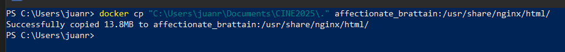
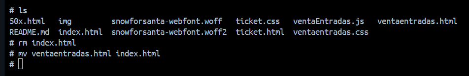

# 🎬 Proyecto CINE2025 - Tutorial Paso a Paso

Este proyecto muestra cómo desplegar una aplicación web de **venta de entradas de cine** utilizando **Nginx** dentro de un contenedor **Docker**.  
Aquí encontrarás una guía paso a paso para que puedas replicarlo fácilmente.

---

## 🛠️ Requisitos previos
Antes de comenzar asegúrate de tener instalado:
- [Docker](https://docs.docker.com/get-docker/)
- Archivos de tu proyecto (HTML, CSS, JS, imágenes, etc.)

---

## 1️⃣ Preparar los archivos
Tu proyecto debe tener una estructura parecida a esta:

```
CINE2025/
├── index.html
├── ventaentradas.css
├── ventaEntradas.js
├── ticket.html
├── ticket.css
├── 50x.html
├── img/
└── fonts/
```

El archivo **index.html** será el que se muestre primero al abrir la aplicación en el navegador.

---

## 2️⃣ Copiar los archivos al contenedor
Copia todo tu proyecto desde tu computadora al contenedor de Docker dentro de la carpeta de Nginx:

```powershell
docker cp "C:\Users\juann\Documents\CINE2025\." affectionate_brattain:/usr/share/nginx/html/
```

📌 *Reemplaza `affectionate_brattain` por el nombre de tu contenedor.*

📸 Ejemplo:  


---

## 3️⃣ Configurar la página principal
Dentro del contenedor, lista el contenido de la carpeta:

```bash
ls /usr/share/nginx/html/
```

- Borra el `index.html` que viene por defecto con Nginx:
  ```bash
  rm index.html
  ```

- Renombra tu archivo principal para que se use como página de inicio:
  ```bash
  mv ventaentradas.html index.html
  ```

📸 Ejemplo del reemplazo:  


---

## 4️⃣ Ver la aplicación en el navegador
Ahora abre tu navegador y entra en:

```
http://localhost
```

¡Listo! 🎉 Tu aplicación de **venta de entradas de cine** estará funcionando dentro del contenedor.

---

## 📂 Estructura del proyecto
```
CINE2025/
├── index.html
├── ventaentradas.css
├── ventaEntradas.js
├── ticket.html
├── ticket.css
├── 50x.html
├── img/
└── fonts/
```

---

## 🚀 Resultado final
Con estos pasos lograste:
- Subir tus archivos al contenedor Docker
- Configurar la página principal de Nginx
- Ver tu aplicación corriendo en `http://localhost`
- 
Con este proceso ya tienes tu aplicación funcionando en Nginx dentro de Docker, lista para pruebas o despliegue real. 🚀

